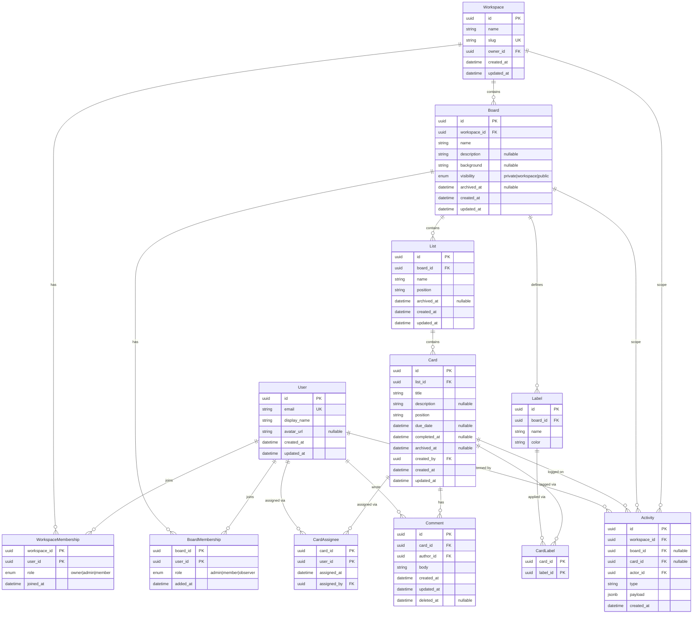

# ER 図

```mermaid
erDiagram
    User ||--o{ WorkspaceMembership : "joins"
    Workspace ||--o{ WorkspaceMembership : "has"
    Workspace ||--o{ Board : "contains"
    Workspace ||--o{ Activity : "scope"
    User ||--o{ BoardMembership : "joins"
    Board ||--o{ BoardMembership : "has"
    Board ||--o{ List : "contains"
    Board ||--o{ Label : "defines"
    Board ||--o{ Activity : "scope"
    List ||--o{ Card : "contains"
    Card ||--o{ CardLabel : "tagged via"
    Label ||--o{ CardLabel : "applied via"
    Card ||--o{ CardAssignee : "assigned via"
    User ||--o{ CardAssignee : "assigned via"
    Card ||--o{ Comment : "has"
    User ||--o{ Comment : "wrote"
    Card ||--o{ Activity : "logged on"
    User ||--o{ Activity : "performed by"

    User {
        uuid id PK
        string email UK
        string display_name
        string avatar_url "nullable"
        datetime created_at
        datetime updated_at
    }
    Workspace {
        uuid id PK
        string name
        string slug UK
        uuid owner_id FK
        datetime created_at
        datetime updated_at
    }
    WorkspaceMembership {
        uuid workspace_id PK
        uuid user_id PK
        enum role "owner|admin|member"
        datetime joined_at
    }
    Board {
        uuid id PK
        uuid workspace_id FK
        string name
        string description "nullable"
        string background "nullable"
        enum visibility "private|workspace|public"
        datetime archived_at "nullable"
        datetime created_at
        datetime updated_at
    }
    BoardMembership {
        uuid board_id PK
        uuid user_id PK
        enum role "admin|member|observer"
        datetime added_at
    }
    List {
        uuid id PK
        uuid board_id FK
        string name
        string position
        datetime archived_at "nullable"
        datetime created_at
        datetime updated_at
    }
    Card {
        uuid id PK
        uuid list_id FK
        string title
        string description "nullable"
        string position
        datetime due_date "nullable"
        datetime completed_at "nullable"
        datetime archived_at "nullable"
        uuid created_by FK
        datetime created_at
        datetime updated_at
    }
    Label {
        uuid id PK
        uuid board_id FK
        string name
        string color
    }
    CardLabel {
        uuid card_id PK
        uuid label_id PK
    }
    CardAssignee {
        uuid card_id PK
        uuid user_id PK
        datetime assigned_at
        uuid assigned_by FK
    }
    Comment {
        uuid id PK
        uuid card_id FK
        uuid author_id FK
        string body
        datetime created_at
        datetime updated_at
        datetime deleted_at "nullable"
    }
    Activity {
        uuid id PK
        uuid workspace_id FK
        uuid board_id FK "nullable"
        uuid card_id FK "nullable"
        uuid actor_id FK
        string type
        jsonb payload
        datetime created_at
    }
```
